# 🟩 B083-NETWORKWALKS

## 🟪 RECONNAISSANCE & NETWORK MAPPING & VULNERABILITY REPORT

---

### 🟢 PHASE 01 — OSINT RECONNAISSANCE
**Tool:** `MALTEGO`
**Objective:** Gather open-source intelligence on target infrastructure, domains, and associated entities.

---

### 🔵 PHASE 02 — NETWORK DISCOVERY & MAPPING
**Tool:** `ZENMAP / NMAP`
**Objective:** Identify live hosts, open ports, running services, and network topology.

---

### 🟠 PHASE 03 — VULNERABILITY ASSESSMENT
**Tool:** `NESSUS`
**Objective:** Scan discovered assets for known vulnerabilities and misconfigurations.

---

## 📋 ENGAGEMENT DETAILS

| Field | Value |
|---|---|
| 🟢 **Status** | `AUTHORIZED` |
| 🔵 **Target** | `networkwalks.com / HOME LAB` |
| 🟣 **Date** | `16 SEPTEMBER 2026` |

---

> ⚠️ *This report documents an authorized security assessment conducted strictly within the defined scope and rules of engagement.*
`IMPORTANT — LEGAL AND ETHICAL USE ONLY`

---

## 📋 W2-PM3-FINAL | CYBERSECURITY | NETWORKWALKS

### Engagement Information

| **Item** | **Information** |
|---|---|
| **Analyst / Pentester** | Safwan Abdurahiman Kavil |
| **Role / Title** | Cybersecurity Intern |
| **Engagement Name** | B083-Networkwalks |
| **Client / Target Scope** | `networkwalks.com` — Home Lab |
| **Authorization on File** | Yes — Approval secured from `networkwalks.com` |
| **Report Date** | 16 September 2026 |

### Assessment Scope

| **Category** | **Details** |
|---|---|
| **OSINT / Reconnaissance** | Maltego |
| **Network Discovery & Mapping** | Zenmap / Nmap |
| **Vulnerability Assessment** | Nessus |
| **Phase 1** | OSINT Reconnaissance |
| **Phase 2** | Network Discovery & Mapping |
| **Phase 3** | Nessus Scanning|
---

## 🗂 Report Index

1. [Authorization & Liability Disclaimer](#s1)
2. [Executive Summary](#s2)
3. [Scope & Objectives](#s3)
4. [Methodology & Tools Used](#s4)
5. [Activities Performed](#s5)
   - [5.1 OSINT Reconnaissance (Maltego)](#51-osint-reconnaissance-maltego)
   - [5.2 Network Mapping (Zenmap)](#52-network-mapping-zenmap)
   - [5.3 Vulnerability Assessment (Nessus)](#53-vulnerability-assessment-nessus)
6. [Findings & Risk Analysis](#s6)
7. [Recommendations](#s7)
8. [Conclusion](#s8)
9. [Evidence & Appendix](#s9)
10. [Author & Project Information](#s10)

---

## `[ SECTION 01 ]` Authorization & Liability Disclaimer

This assessment was performed only against systems and assets for which written authorization was obtained — specifically **networkwalks.com** , **my own Home Lab** — and/or systems and devices that I own myself.

All activities described in this report are conducted for authorized security assessment, education and research purposes only. Nothing in this document should be used to access, scan or test any system without explicit written permission from its owner. Every action taken is the responsibility of the person performing it. Misuse of these techniques may result in criminal charges, civil liability, loss of employment and a permanent record. In most jurisdictions, unauthorized access to a computer system is a crime even when no damage occurs.

---

## `[ SECTION 02 ]` Executive Summary

An authorized security assessment was conducted against the lab environment using Maltego, Zenmap/Nmap, and Nessus to evaluate OSINT exposure, identify active network hosts, and assess system vulnerabilities.

The Maltego OSINT assessment identified one publicly discoverable organizational email address, info@networkwalks.com. As this is a generic mailbox and no credentials or sensitive information were identified, the finding presents a Low risk, with its primary value being reconnaissance and potential exposure to phishing or spam.

Using Zenmap, five active devices were identified within the authorized lab network: Kali Linux, Windows 7, Windows Server 2016, Windows 10, and the VirtualBox NAT Network gateway. Since the scan was limited to host discovery, these results represent network reconnaissance information rather than vulnerabilities.

The Nessus scan produced a significantly larger set of findings on the Windows 7, Windows Server 2016, and Windows 10 systems. The results indicate issues including missing security updates, outdated components, and potentially insecure configurations, with the legacy Windows 7 system requiring particular attention.

Overall, the assessment found that the main security exposure lies within the Windows systems identified by Nessus, rather than the OSINT or network-discovery findings. Remediation should focus on prioritizing high-severity vulnerabilities, applying security updates, reviewing configurations, and isolating or replacing unsupported legacy systems where appropriate.

---

## `[ SECTION 03 ]` Scope & Objectives

**Objectives**
- ▸ Map the external OSINT footprint of the authorized target using Maltego
- ▸ Discover and map live hosts, services and topology on the in-scope network using Zenmap
- ▸ Scan and analyze vulnerabilities of the discovered network endpoints using Nessus

**In Scope**

networkwalks.com
10.0.0.0/24 NatNetwork
HOMELAB domain of Windows Server 2016

**Out of Scope**

Web Applications
Web Servers
Other Networks (WAN, Internet)

**Constraints / Rules of Engagement**

Only allowed to scan email domains under explicit authorization from networkwalks.com
Home network reconnaissance is limited under an isolated Virtual Box NatNetwork
No exploitation allowed; only passive reconnaissance and vulnerability/risk analysis permitted. 

---

## `[ SECTION 04 ]` Methodology & Tools Used

The table below lists each tool used during this engagement and its purpose.

| Tool | Purpose |
|---|---|
| **Maltego** | Graph-based OSINT reconnaissance — mapping domains, subdomains, infrastructure, email addresses, personas and related entities tied to the target. |
| **Zenmap (Nmap GUI)** | Active network discovery and mapping — identifying live hosts, IP/MAC addresses, open ports, services and network topology. |
| **Nessus** | Passive network reconnaissance, vulnerability assessment, and analysis |
| **Supporting OS** | Kali Linux and Windows 11 |
| **Target OS** | Windows 7, Windows Server 2016, Windows 10 |

---

## `[ SECTION 05 ]` Activities Performed

### 5.1 OSINT Reconnaissance (Maltego)

- ▸ Domain: networkwalks.com
- ▸ Infrastructure mapped: 1 email mapping
- ▸ Email addresses: 1 email address (info@networkwalks.com)
- ▸ Notable relationships or pivot points surfaced by the graph: Contact point email mapped to networkwalks.com

### 5.2 Network Mapping (Zenmap)

- ▸ Subnet / range scanned: 10.0.0.0/24
- ▸ Live hosts identified: 5
- ▸ Notable open ports / services: 80, 135, 3389, 445
- ▸ Topology exported (Yes/No, format): Yes, ".pdf"

### 5.3 Vulnerability Assessment (Nessus)
- ▸ Hosts scanned: 10.0.0.10, 10.0.0.16, 10.0.0.7
- ▸ Live hosts identified: 3
- ▸ Situation: All 3 hosts need serious risk assessment and mitigation
- ▸ Considerations: Legacy isolation, patching, responsible server configuration
---

## `[ SECTION 06 ]` Findings & Risk Analysis

Based on the OSINT reconnaissance, network mapping activities, and vulnerability assessment, the following potential risks were identified.

## 🔒 Maltego Risk Assessment — networkwalks.com

**Scope:** networkwalks.com

| # | Finding | Evidence / Observation | Potential Impact | Risk |
|---|---|---|---|---|
| 1 | **Email Identified** | maltego email transform returned an email address of "info@networkwalks.com" and the email ID exposes itself to networkwalks.com | Potential for exposure to phishing and spam. | 🟢 **Low** |

**Risk level key:** 🔴 Critical &nbsp;&nbsp; 🟠 High &nbsp;&nbsp; 🟡 Medium &nbsp;&nbsp; 🟢 Low

## 🔒 Network Risk Assessment — Homelab Domain (10.0.0.0/24)

**Scope:** 4 live remote VMs and 1 hypervisor | DC (Win Server, 2016), Win10 workstation, Win7/2008R2 legacy host, unidentified gateway/hypervisor, unclassified host.

| # | Finding | Evidence / Observation | Potential Impact | Risk |
|---|---|---|---|---|
| 1 | **Domain Controller fully exposed** | `10.0.0.16` (DC01) has LDAP(389/3268), Kerberos(88), SMB(445), NetBIOS(139), RPC(135/593), WinRM(5985) all open to the whole /24. FQDN `homelab.local` disclosed. | A compromised host anywhere on this network has direct line-of-sight to AD for enumeration, Kerberoasting, and SMB relay/attack against the DC — the single point of failure for the domain. | 🔴 **Critical** |
| 2 | **Unsupported / legacy OS in domain** | `10.0.0.7` fingerprints as **Windows 7 / Server 2008 R2** (96% confidence) — both long past end-of-life with no vendor patches. | No security updates means any newly disclosed SMB/RPC vuln (e.g., EternalBlue-class) is permanently exploitable; a soft entry point for lateral movement to the DC. | 🔴 **Critical** |
| 3 | **RDP + database exposed on gateway/hypervisor host** | `10.0.0.1` exposes **RDP (3389)**, **PostgreSQL (5432)**, VMware auth (902/912), and IIS (80) simultaneously — an unusual, high-value multi-service host. | RDP is a top brute-force/ransomware entry vector; an internet- or LAN-reachable DB with no visible auth context risks direct data exposure or use as a pivot into the virtualization layer. | 🟠 **High** |
| 4 | **Minimal patch/version visibility across endpoints** | `10.0.0.7` and `10.0.0.10` return only port 135 (RPC) with no service banners; DC's `microsoft-ds` reports as **Server 2008 R2–2012 build strings** despite guessed OS being 2016 — inconsistent SMB stack. | Blind spots prevent confirming patch level; mismatched SMB version strings suggest outdated or unpatched components that standard vuln scanning would need to verify directly. | 🟡 **Medium** |

---
**Risk level key:** 🔴 Critical &nbsp;&nbsp; 🟠 High &nbsp;&nbsp; 🟡 Medium &nbsp;&nbsp; 🟢 Low

## 🔒 Nessus Risk Assessment — Homelab Domain (10.0.0.0/24)

**Scope:** 3 live remote VMs and 1 hypervisor| DC (Win Server, 2016), Win10 workstation, Win7/2008R2 legacy host, gateway/hypervisor.

| # | Finding | Evidence / Observation | Potential Impact | Risk |
|---|---|---|---|---|
| 1 | **Vulnerability in TCP/IP** | The TCP/IP stack in use on the remote Windows 7 host is affected by an integer overflow vulnerability. | Sending a continuous flow of specially crafted UDP packets to a closed port can result in arbitrary code execution in kernel mode. | 🔴 **Critical** |
| 2 | **DNS Server RCE** | A remote code execution (RCE) vulnerability exists in Windows Domain Name System servers (Server 2016) when they fail to properly handle requests. | An attacker who successfully exploited the vulnerability could run arbitrary code in the context of the Local System Account. | 🔴 **Critical** |
| 3 | **SMBv1 Improper Handling** | An information disclosure vulnerability (in Server 2016) exists in Microsoft Server Message Block 1.0 (SMBv1) due to improper handling of certain requests. | An unauthenticated, remote attacker can exploit this, via a specially crafted packet, to disclose sensitive information. (For instance, the Eternal Blue exploit leverages this vulnerability for unauthorized access.  | 🔴 **Critical** |
| 4 | **Missing Crucial Patch** | The remote Windows 10 host is missing security update to latest patch of Oct 2025. It is, therefore, affected by multiple vulnerabilities | The system is vulnerable to various issues involving buffer overflow and secure boot misconfigurations which can be exploited by attacker for denial of service and malicious execution.| 🟠 **High** |
| 5 | **IIS Path Disclosure** | The NAT Network gateway (10.0.0.1), corresponding to the VirtualBox host machine, reveals the physical path of the host's IIS webroot when a nonexistent page is requested. | Detailed error messages are useful for debugging but should not be exposed to remote clients, as they can reveal internal filesystem of core Host Machine information (in this case, my own PC) and assist further reconnaissance or exploitation. | 🟡 **Medium** |

**Risk level key:** 🔴 Critical &nbsp;&nbsp; 🟠 High &nbsp;&nbsp; 🟡 Medium &nbsp;&nbsp; 🟢 Low

***These findings are observations from reconnaissance, mapping, and scanning activities, not confirmed exploitable vulnerabilities. No exploitation was performed as part of this engagement unless explicitly stated above. Further authorized pentesting would be required to confirm actual exploitability.***

---

## `[ SECTION 07 ]` Recommendations

### `Maltego Risks`
1. **Review the public OSINT footprint** — Periodically audit what Maltego / public sources reveal about the domain networkwalks.com.
2. **Reduce infrastructure exposure** — Based on the audit and periodic scanning, decide what infrastructure needs less exposure than required by implementing least privilege principle.

---

### `Discovery Risks`
| # | Finding Addressed | Recommendation | Why This Approach (Preserves Availability) |
|---|---|---|---|
| 1 | DC fully exposed on flat network | Place `10.0.0.16` behind host-based firewall rules restricting 389/445/3268/5985 to authorized admin subnets only. Leave 88 (Kerberos)/389 (LDAP) reachable from client subnet — domain auth must keep working. | Blocks lateral-movement/enumeration paths from workstations without breaking domain logon, DNS, or GPO — AD stays fully functional for legitimate clients. |
| 2 | Windows 7 / Server 2008 R2 host (`10.0.0.7`) | Short-term: isolate on its own VLAN with only the specific ports/services it needs to talk to (no general LAN access). Medium-term: schedule replacement/upgrade — this OS cannot be secured long-term. | Isolation removes it as a pivot point immediately without shutting it down, keeping whatever workload it runs online while you plan the actual decommission. |
| 3 | RDP + PostgreSQL exposed on `10.0.0.1` | Restrict RDP (3389) and PostgreSQL (5432) to a defined admin IP allow-list or jump host; keep IIS (80) open only if it's a required service. Enable MFA on RDP if not already. | Admins retain full remote access and DB connectivity from their own machines; only unrestricted/anonymous LAN exposure is removed — zero disruption to legitimate admin workflow. |
| 4 | Unclear patch level / inconsistent SMB versions | Run an authenticated vulnerability scan (e.g., Nessus/OpenVAS credentialed scan) against DC and both workstations to confirm actual patch state before deciding on fixes. | Read-only verification step — no config changes, no downtime risk — but removes guesswork before touching production SMB/AD services. |

---

### `Nessus Risks`
| # | Finding Addressed | Recommendation |
|---|---|---|
| 1 | **Vulnerability in TCP/IP**  | Microsoft has released a set of patches for Windows Vista, 2008, 7, and 2008 R2. Apply the relevant patch update for short term use. However, isolation and upgrade to latest Windows OS is the long term recommended approach.|
| 2 | **DNS Server RCE** | Apply the appropriate security update or mitigation as described in the Microsoft advisory. |
| 3 | **SMBv1 Improper Handling** | Apply the applicable security update for your Windows version, in this case, Windows Server 2016: KB4019472|
| 4 | **Missing Crucial Patch** | Apply security update to October Patch 2025 (Windows 10 22H2): 5066791 |
| 5 | **IIS Path Disclosure** | Configure IIS (C:\Windows\System32\inetsrv\) to disable Detailed Errors for remote clients and use generic/custom error pages. Also review the application under C:\inetpub\wwwroot to ensure errors do not disclose local file paths. |

---

## `[ SECTION 08 ]` Conclusion

This engagement combined OSINT reconnaissance (Maltego), active network mapping (Zenmap/Nmap), and credentialed vulnerability assessment (Nessus) against the networkwalks.com homelab. OSINT exposure was minimal (a single contact email). Network mapping identified 5 hosts — including a Windows Server 2016 DC, a Windows 10 workstation, and a legacy Windows 7 host — with RDP, SMB, LDAP, Kerberos, and a database exposed on a flat, unsegmented network. Nessus confirmed these exposures as real, exploitable vulnerabilities: a kernel-level TCP/IP flaw on Windows 7, DNS Server RCE and SMBv1 disclosure on the DC, missing patches on Windows 10, and IIS path disclosure on the gateway.

Overall, the security posture is **weak to moderate**: the Domain Controller and legacy endpoints are directly reachable and unpatched, placing the core of the domain at meaningful risk. The key takeaway is that each phase validated the next — OSINT mapped the external footprint, network scanning revealed the internal attack surface, and vulnerability scanning proved that surface maps to real, exploitable risk. Network segmentation, patching, and least-privilege exposure are the priority fixes.

All activity in this report was performed strictly within the scope authorized by networkwalks.com. No exploitation was conducted; confirming exploitability would require a separately authorized penetration test.

---

## `[ SECTION 09 ]` Evidence & Appendix

### 📷 Maltego

| Screenshot |
|---|
| 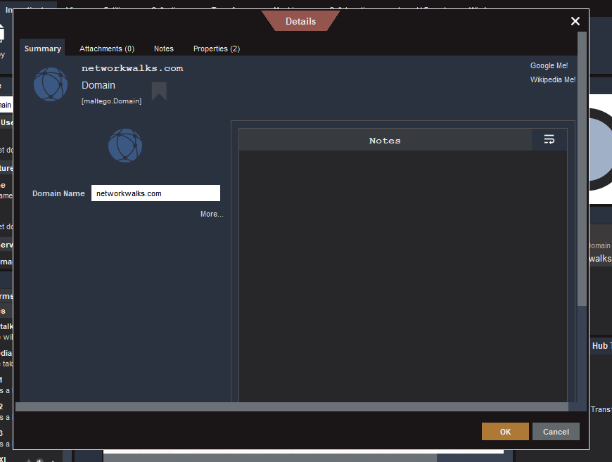 |
| 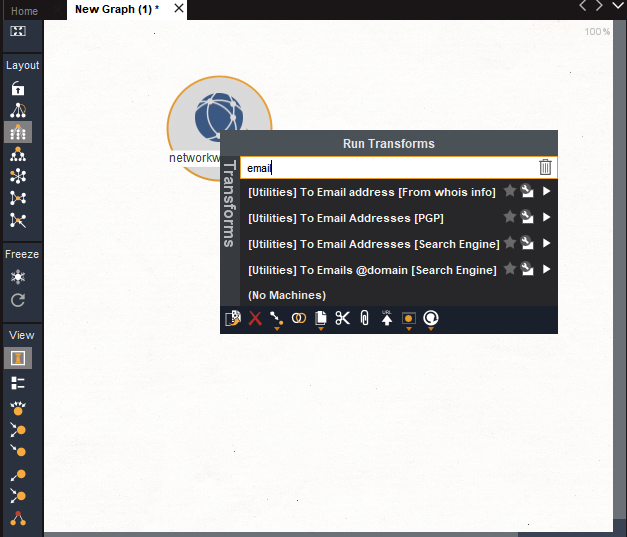 |
| 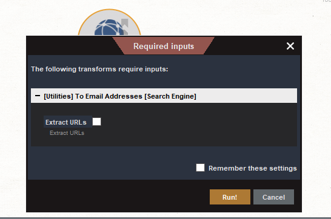 |
| 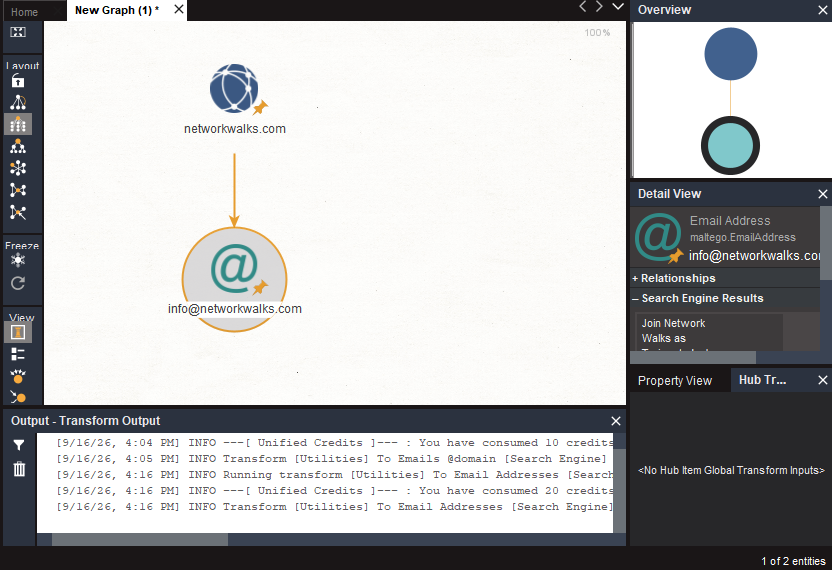 |

### 📷 Zenmap

| Screenshot |
|---|
| 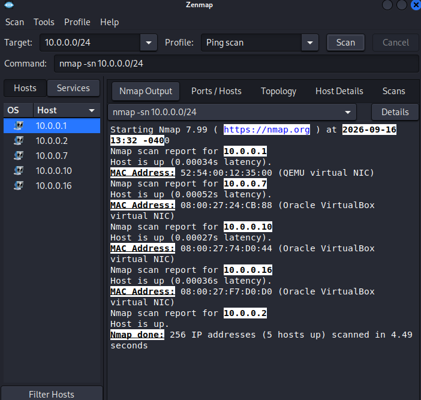 |
| 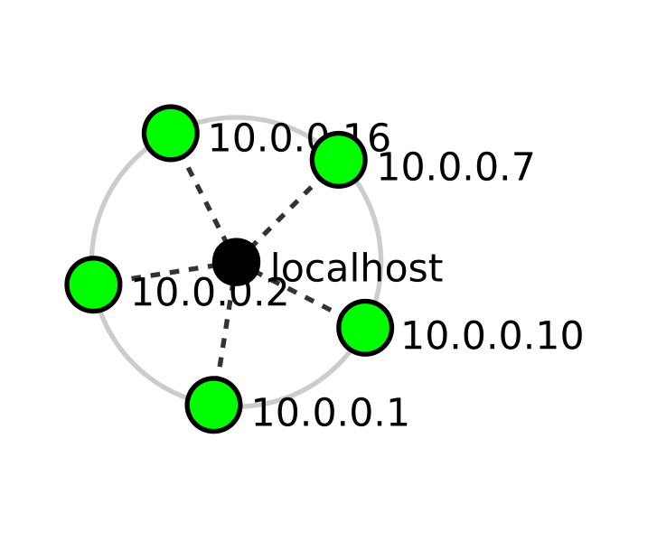 |

### 📷 Nessus

| Screenshot |
|---|
| 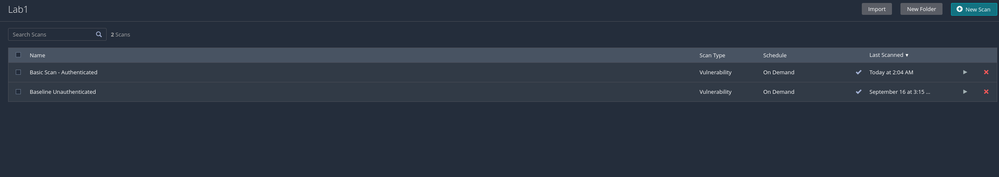 |
| 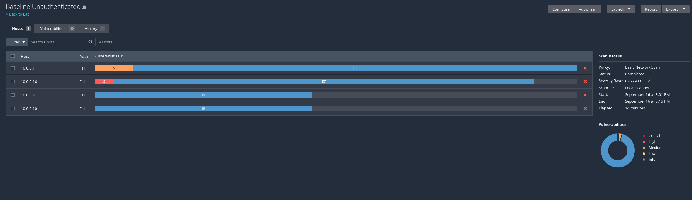 |
| 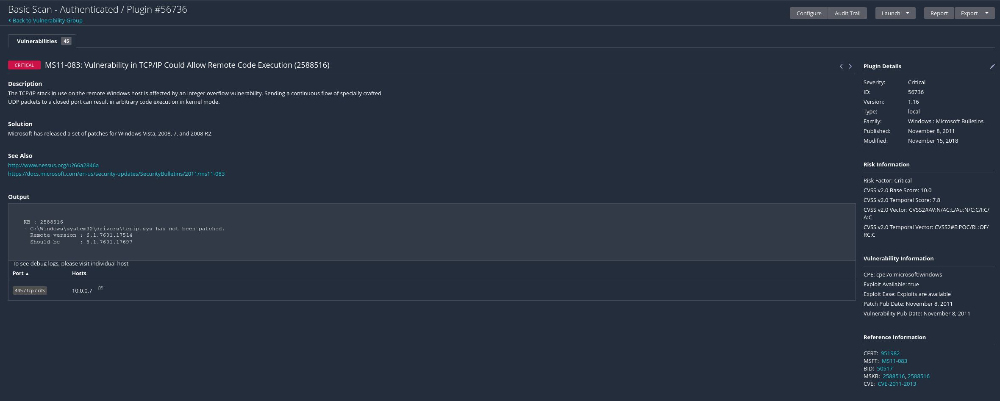 |
| 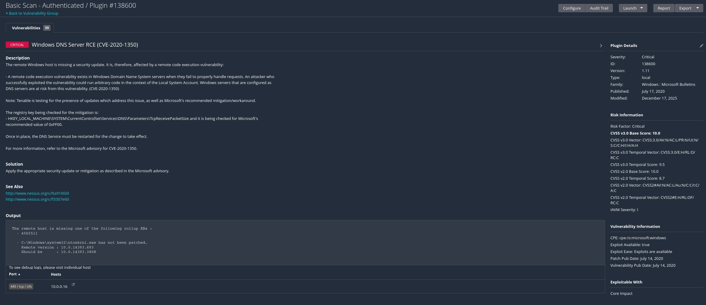 |
| 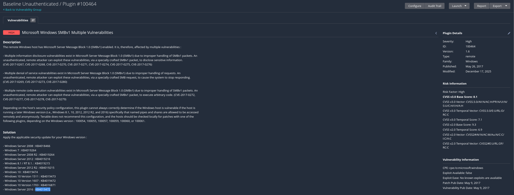 |
| 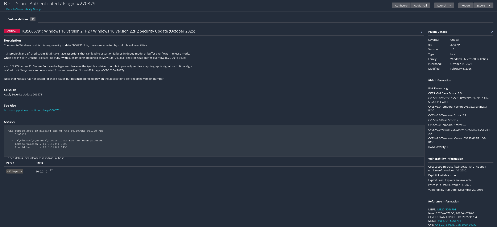 |
| 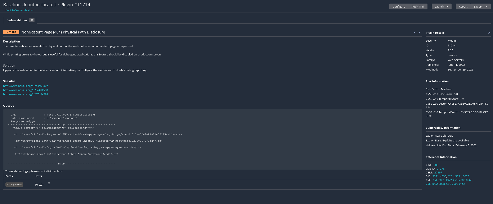 |

---

## `[ SECTION 10 ]` Author & Project Information

**👤 Author**
`Safwan Abdurahiman Kavil` — `CompTIA Security+`
LinkedIn: `www.linkedin.com/in/safwan-abdurahiman-kavil-sak03`

**📌 Project Information**
Program: `W2-PM3-FINAL` | Week / Phase: `[2]`

---

