# 🟩 B083-NETWORKWALKS

## 🟪 PASSWORD CRACKING REPORT

---

### 🟢 PHASE 01 — PASSWORD CRACKING WITH JOHN THE RIPPER
**Tool:** `JOHN THE RIPPER`
**Objective:** Crack an authorized and protected PDF file using JTR and JOHNNY.

---

### 🔵 PHASE 02 — PASSWORD CRACKING WITH NETWORKWALKS
**Tool:** `NETWORKWALKS IN-HOUSE TOOLS`
**Objective:** Crack an authorized and protected PDF file using NETWORKWALKS tools.

---

### 🟠 PHASE 03 — AI BASED PASSWORD CRACKING
**Tool:** `CLAUDE + HEXSTRIKE MCP + JOHN THE RIPPER`
**Objective:** Use the AI-based setup to crack the password and capture the flag of a PDF file.

---

## 📋 ENGAGEMENT DETAILS

| Field | Value |
|---|---|
| 🟢 **Status** | `AUTHORIZED` |
| 🔵 **Target** | `networkwalks' PDF files` |
| 🟣 **Date** | `23 SEPTEMBER 2026` |

---

> ⚠️ *This report documents an authorized security assessment conducted strictly within the defined scope and rules of engagement.*
`IMPORTANT — LEGAL AND ETHICAL USE ONLY`

---

## 📋 W2-PM3-FINAL | CYBERSECURITY | NETWORKWALKS

### Engagement Information

| **Item** | **Information** |
|---|---|
| **Analyst / Pentester** | Safwan Abdurahiman Kavil |
| **Role / Title** | Cybersecurity Intern |
| **Engagement Name** | B083-Networkwalks |
| **Client / Target Scope** | `networkwalks' PDF files`|
| **Authorization on File** | Yes — Approval secured from `networkwalks.com` |
| **Report Date** | 23 September 2026 |

### Assessment Scope

| **Category** | **Details** |
|---|---|
| **Password Cracking Base Tool** | John The Ripper |
| **Password Cracking GUI** | Johnny |
| **Password Cracking Agent** | Hexstrike MCP |
| **AI Tool** | Claude |
| **Phase 1** | PASSWORD CRACKING WITH JOHN THE RIPPER |
| **Phase 2** | PASSWORD CRACKING WITH NETWORKWALKS |
| **Phase 3** | AI BASED PASSWORD CRACKING|
---

## 🗂 Report Index

1. [Authorization & Liability Disclaimer](#s1)
2. [Executive Summary](#s2)
3. [Scope & Objectives](#s3)
4. [Methodology & Tools Used](#s4)
5. [Activities Performed](#s5)
   - [5.1 Password Cracking with John the Ripper](#51-osint-reconnaissance-maltego)
   - [5.2 NetworkWalks Cracking Tools](#52-network-mapping-zenmap)
   - [5.3 Vulnerability Assessment (Nessus)](#53-vulnerability-assessment-nessus)
6. [Findings & Risk Analysis](#s6)
7. [Recommendations](#s7)
8. [Conclusion](#s8)
9. [Evidence & Appendix](#s9)
10. [Author & Project Information](#s10)

---

## `[ SECTION 01 ]` Authorization & Liability Disclaimer

This assessment was performed only against systems and assets for which written authorization was obtained — specifically **networkwalks.com** , **my own Home Lab** — and/or systems and devices that I own myself.

All activities described in this report are conducted for authorized security assessment, education and research purposes only. Nothing in this document should be used to access, scan or test any system without explicit written permission from its owner. Every action taken is the responsibility of the person performing it. Misuse of these techniques may result in criminal charges, civil liability, loss of employment and a permanent record. In most jurisdictions, unauthorized access to a computer system is a crime even when no damage occurs.

---

## `[ SECTION 02 ]` Executive Summary

---

## `[ SECTION 03 ]` Scope & Objectives

**Objectives**
- ▸ Crack an authorized and protected PDF file using JTR and JOHNNY.
- ▸ Crack an authorized and protected PDF file using NETWORKWALKS tools.
- ▸ Use the AI-based setup to crack the password and capture the flag of a PDF file.

**In Scope**

networkwalks' PDF Files

**Out of Scope**
networkwalks.com
Web Applications
Web Servers
Other Networks (WAN, Internet)

**Constraints / Rules of Engagement**

Only allowed to crack PDF files under explicit authorization from networkwalks.com.
Cracking will be isolated within a possible VM machine network.

---

## `[ SECTION 04 ]` Methodology & Tools Used

The table below lists each tool used during this engagement and its purpose.

| Tool | Purpose |
|---|---|
| **John The Ripper** | John the Ripper (JTR) is a popular password cracking tool used by security professionals to test how strong passwords are. |
| **NetworkWalks Cracking Tools** | A Hash Calculator to take the hash out of a locked PDF file. Then, a Password Cracker to find the real password from that hash. |
| **Hexstrike MCP** | Advanced AI-powered penetration testing MCP framework consisting of security tools and autonomous AI agents |
| **Claude AI** | AI Agent overlay connected to Hexstrike server for autonomous operations and analysis |

---

## `[ SECTION 05 ]` Activities Performed

### 5.1 Password Cracking with John the Ripper

- ▸ Target: My Locked PDF1.pdf
- ▸ Password cracked?: Yes
- ▸ Flag Acquired: nw{cybersecurity_flag_captured_2608}
- ▸ Notable details: A simple flag was captured

### 5.2 NetworkWalks Cracking Tools

- ▸ Target: My Locked PDF2.pdf
- ▸ Password cracked?: Yes
- ▸ Flag Acquired: nw{networkwalks_persistence_jtr_270521}
- ▸ Notable details: A simple flag was captured once again

### 5.3 AI Based Password Cracking

- ▸ Target: My Locked PDF3.pdf
- ▸ Password cracked?: Yes
- ▸ Flag Acquired: nw{networkwalks_flag_260821_1}
- ▸ Notable details: A simple flag was captured again
---

## `[ SECTION 06 ]` Findings & Risk Analysis

Based on the three password cracking activities, the following potential risks were identified.

## 🔒 Password Cracking with John the Ripper

**Scope:** My Locked PDF1.pdf

| # | Finding | Evidence / Observation | Potential Impact | Risk |
|---|---|---|---|---|
| 1 | **Password Cracked Easily** | Was able to crack the password instantly using John and the password was basic. | Potential for risk of unauthorized access. | 🟠 **High** |

**Risk level key:** 🔴 Critical &nbsp;&nbsp; 🟠 High &nbsp;&nbsp; 🟡 Medium &nbsp;&nbsp; 🟢 Low

## 🔒 NetworkWalks Cracking Tools

**Scope:** My Locked PDF2.pdf

| # | Finding | Evidence / Observation | Potential Impact | Risk |
|---|---|---|---|---|
| 1 | **Password Cracked Very Easily** | Was able to crack the password instantly using John and the password was very basic. | Potential for risk of easy unauthorized access. | 🟠 **High** |

---
**Risk level key:** 🔴 Critical &nbsp;&nbsp; 🟠 High &nbsp;&nbsp; 🟡 Medium &nbsp;&nbsp; 🟢 Low

## 🔒 AI Based Password Cracking

**Scope:** My Locked PDF3.pdf

| # | Finding | Evidence / Observation | Potential Impact | Risk |
|---|---|---|---|---|
| 1 | **Password Cracked Very Easily with AI** | Was able to crack the password instantly using John and the password was very basic. | Potential for risk of easy unauthorized access using dictionary attacks. | 🟠 **High** |

---
**Risk level key:** 🔴 Critical &nbsp;&nbsp; 🟠 High &nbsp;&nbsp; 🟡 Medium &nbsp;&nbsp; 🟢 Low

***These findings are just basic observations after password cracking. No exploitation was performed as part of this engagement unless explicitly stated above. Further authorized pentesting would be required to confirm actual exploitability.***

---

## `[ SECTION 07 ]` Recommendations

---

## `[ SECTION 08 ]` Conclusion

---

## `[ SECTION 09 ]` Evidence & Appendix

### 📷 JTR Cracking

| Screenshot |
|---|
| 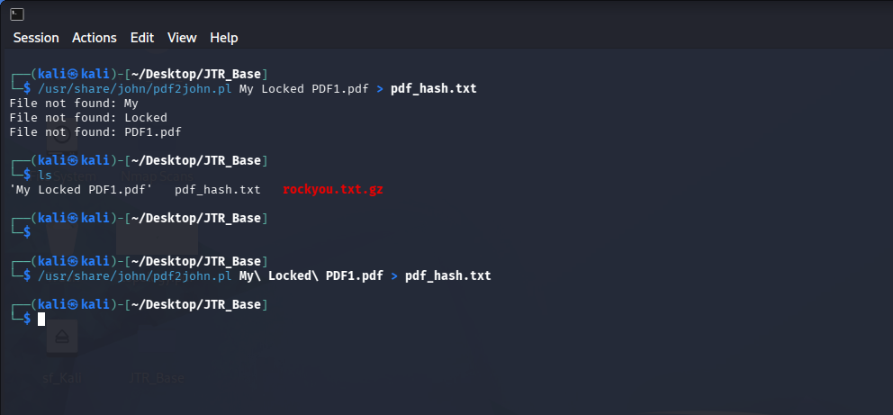 |
| 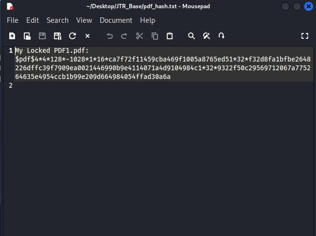 |
| 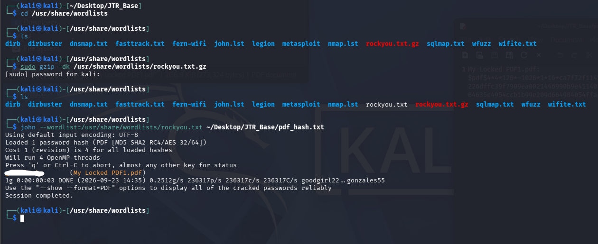 |
| 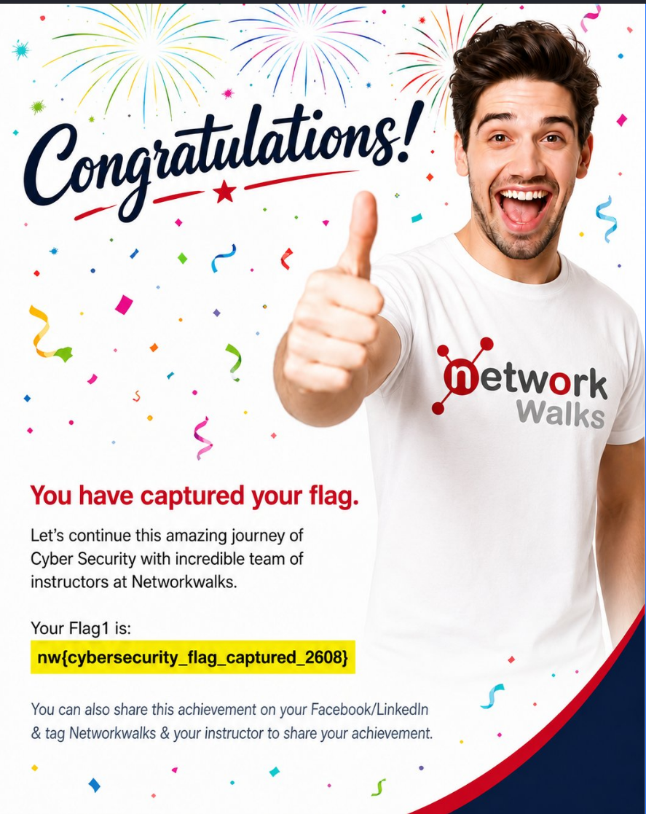 |

### 📷 NetworkWalks Cracking

| Screenshot |
|---|
| 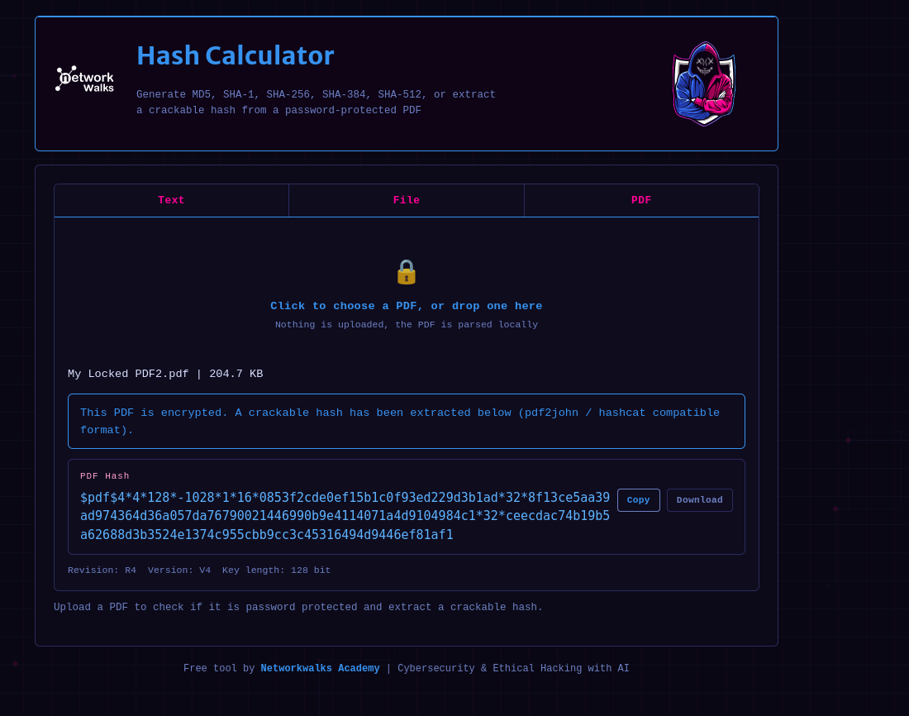 |
| 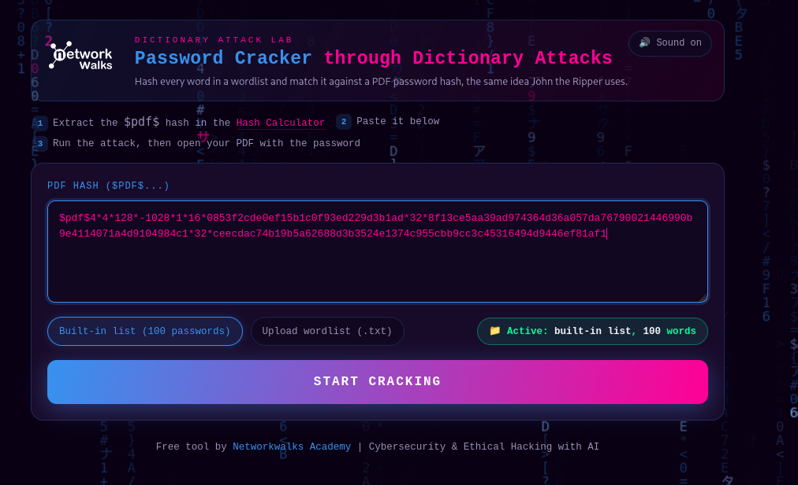 |
| 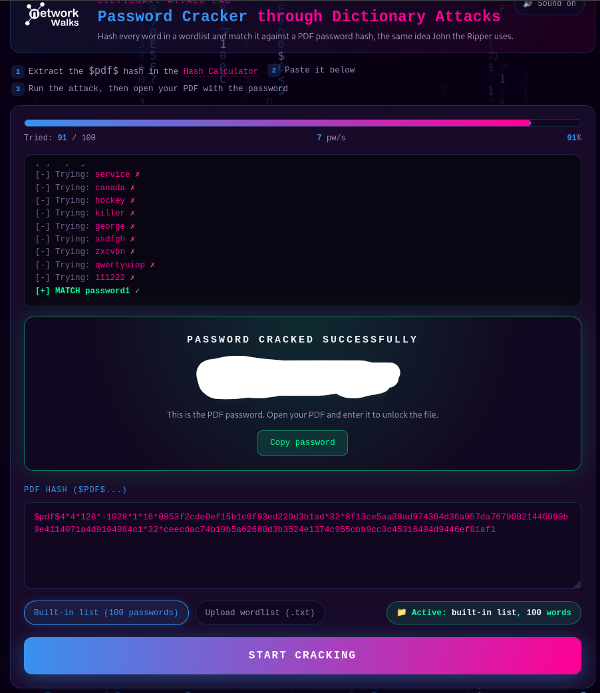 |
| 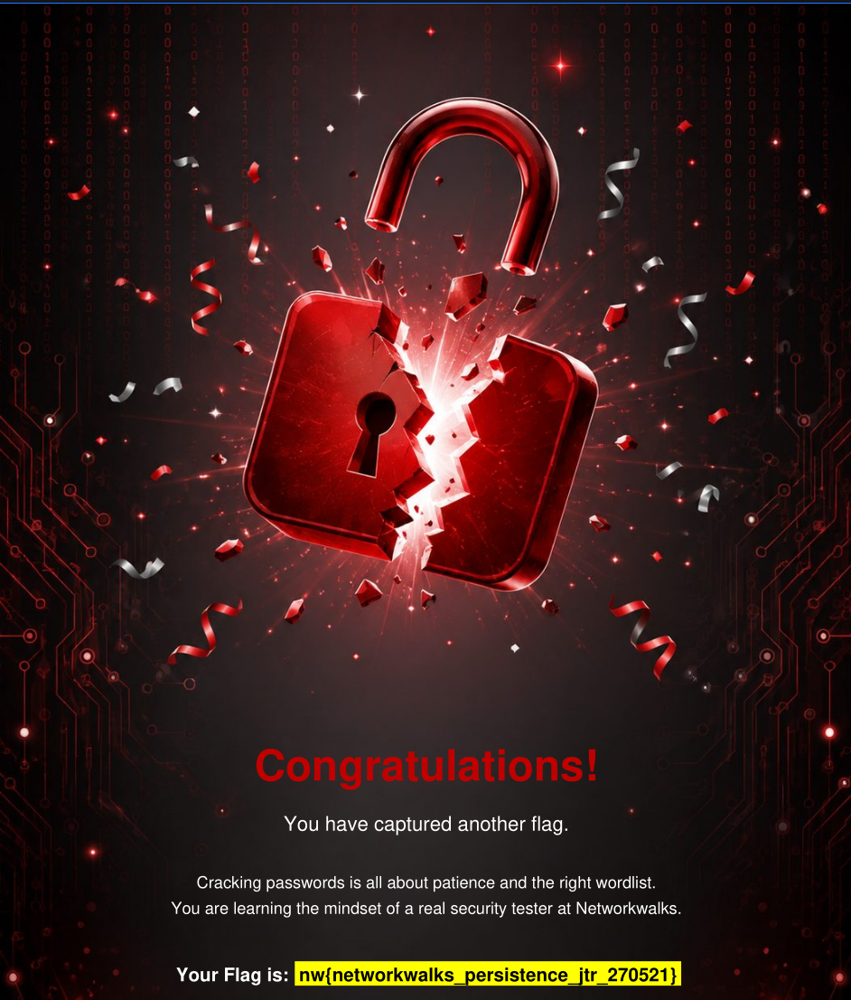 |

### 📷 AI Cracking

| Screenshot |
|---|
| 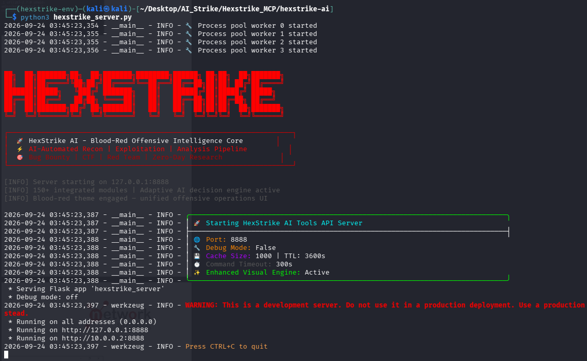 |
| 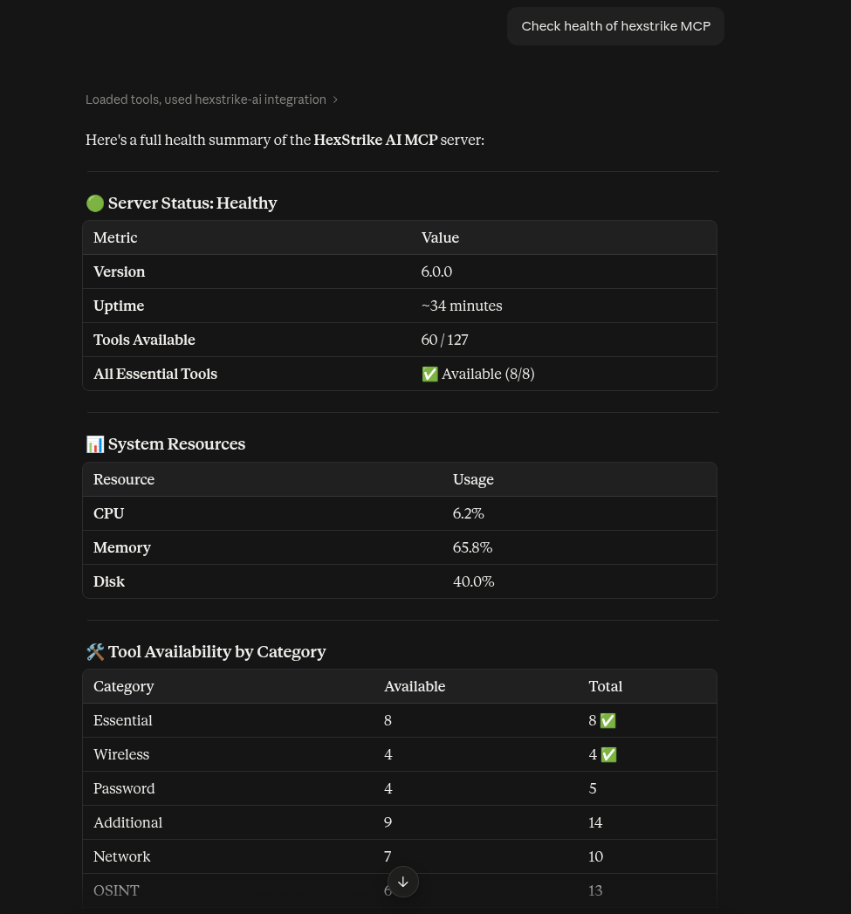 |
| 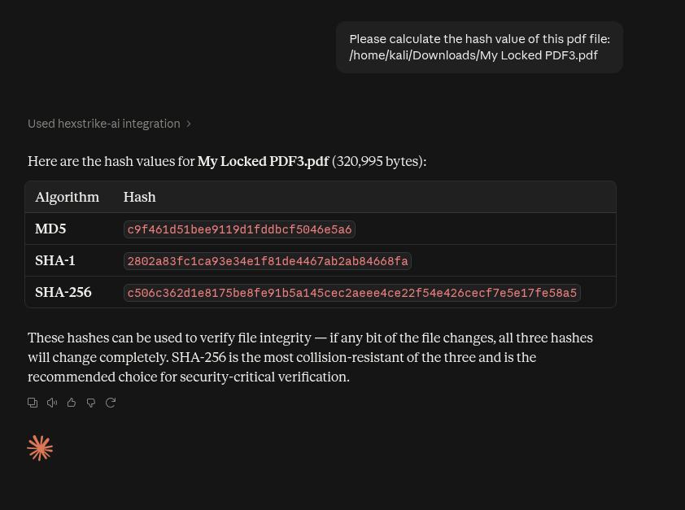 |
| 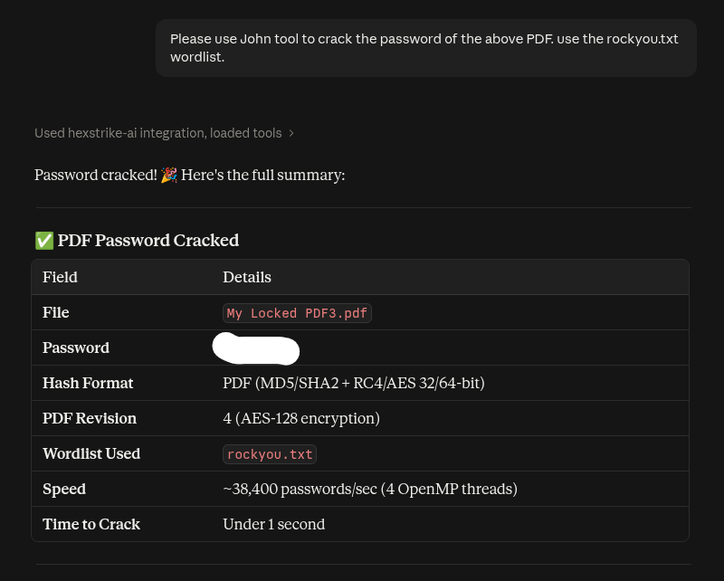 |
| 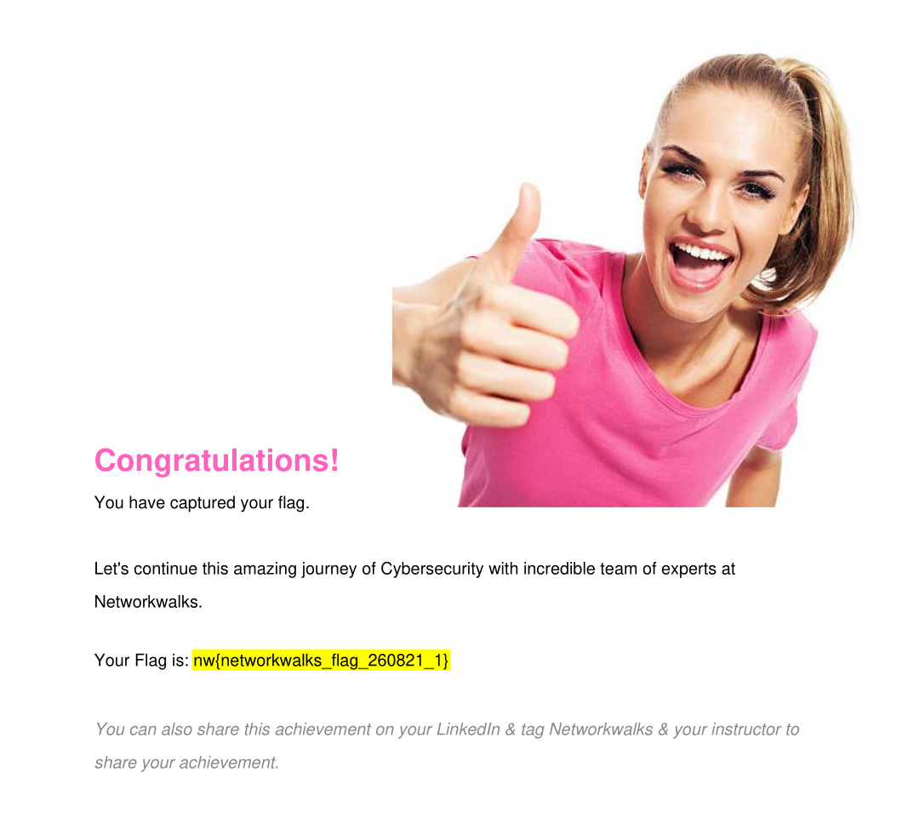 |

---

## `[ SECTION 10 ]` Author & Project Information

**👤 Author**
`Safwan Abdurahiman Kavil` — `CompTIA Security+`
LinkedIn: `www.linkedin.com/in/safwan-abdurahiman-kavil-sak03`

**📌 Project Information**
Program: `W2-PM3-FINAL` | Week / Phase: `[2]`

---

