# 🟩 B083-NETWORKWALKS

## 🟪 VULNERABILITY MITIGATION REPORT

---

### 🟢 PHASE 01 — PATCH & UPDATE REMEDIATION
**Tool:** `WINDOWS UPDATE / MICROSOFT SECURITY UPDATES`
**Objective:** Apply vendor-released patches to close the confirmed Critical and High findings from the Week 2 Nessus assessment.

---

### 🔵 PHASE 02 — NETWORK SEGMENTATION & ACCESS CONTROL HARDENING
**Tool:** `WINDOWS DEFENDER FIREWALL (NETSH / POWERSHELL) + VIRTUALBOX NAT NETWORK MANAGER`
**Objective:** Lock down the Domain Controller's exposed services, contain the unpatchable legacy Windows 7 host, and remove unauthorized host-level exposure on the hypervisor.

---

## 📋 ENGAGEMENT DETAILS

| Field | Value |
|---|---|
| 🟢 **Status** | `AUTHORIZED` |
| 🔵 **Target** | `HOME LAB (10.0.0.0/24)` |
| 🟣 **Date** | `30 SEPTEMBER 2026` |

---

> ⚠️ *This report documents an authorized security assessment conducted strictly within the defined scope and rules of engagement.*
`IMPORTANT — LEGAL AND ETHICAL USE ONLY`

---

## 📋 W4-FINAL | CYBERSECURITY | NETWORKWALKS

### Engagement Information

| **Item** | **Information** |
|---|---|
| **Analyst / Pentester** | Safwan Abdurahiman Kavil |
| **Role / Title** | Cybersecurity Intern |
| **Engagement Name** | B083-Networkwalks |
| **Client / Target Scope** | `Home Lab` |
| **Authorization on File** | Yes — Approval secured from `networkwalks.com` |
| **Report Date** | 30 September 2026 |

### Assessment Scope

| **Category** | **Details** |
|---|---|
| **Patch Remediation** | Windows Update / Microsoft Security Updates |
| **Network Hardening** | Windows Defender Firewall, VirtualBox NAT Network Manager |
| **Validation** | Authenticated Nessus re-scan |
| **Phase 1** | Patch & Update Remediation |
| **Phase 2** | Network Segmentation & Access Control Hardening |

---

## 🗂 Report Index

1. [Authorization & Liability Disclaimer](#s1)
2. [Executive Summary](#s2)
3. [Scope & Objectives](#s3)
4. [Methodology & Tools Used](#s4)
5. [Activities Performed](#s5)
   - [5.1 Patch & Update Remediation](#51-patch--update-remediation)
   - [5.2 Network Segmentation & Access Control Hardening](#52-network-segmentation--access-control-hardening)
6. [Mitigation Results — Before vs After](#s6)
7. [Residual Risk & Next Steps](#s7)
8. [Conclusion](#s8)
9. [Evidence & Appendix](#s9)
10. [Author & Project Information](#s10)

---

## `[ SECTION 01 ]` Authorization & Liability Disclaimer

This assessment was performed only against systems and assets for which written authorization was obtained — specifically **networkwalks.com**, **my own Home Lab** — and/or systems and devices that I own myself.

All activities described in this report are conducted for authorized security assessment, education and research purposes only. Nothing in this document should be used to access, scan, patch or reconfigure any system without explicit written permission from its owner. Every action taken is the responsibility of the person performing it. Misuse of these techniques may result in criminal charges, civil liability, loss of employment and a permanent record. In most jurisdictions, unauthorized access to a computer system is a crime even when no damage occurs.

---

## `[ SECTION 02 ]` Executive Summary

This engagement remediated the findings identified during the Week 2 reconnaissance, mapping, and Nessus vulnerability assessment of the networkwalks home lab (10.0.0.0/24). Nine confirmed findings were addressed across two tracks: vendor patching where a patch existed, and network-level containment where it did not.

Three Critical and High findings tied to missing vendor updates, the DNS Server RCE and SMBv1 disclosure on the Domain Controller, and the missing October 2025 cumulative update on the Windows 10 workstation, were fully resolved through patching. The Domain Controller's exposed service footprint was then locked down with a default-deny firewall policy, scoping AD, DNS, Kerberos and SMB to only the two legitimate client IPs and disabling Remote Desktop and WinRM entirely in favor of console-only management. The hypervisor's exposed RDP and PostgreSQL ports were blocked from the entire lab subnet, and IIS path disclosure was closed with custom error pages. The one exception was the Windows 7 host: it is end-of-life and receives no further vendor patches, so it was instead contained behind strict outbound-only firewall rules limiting it to the exact ports it needs to talk to the Domain Controller and nothing else.

A post-remediation authenticated Nessus scan confirms the impact: unique vulnerabilities across the lab fell from 76 to 55, with the Domain Controller showing the sharpest drop after patching and access scoping. The key takeaway is simple — patching eliminates a vulnerability outright, while containment only shrinks the blast radius. Where a fix exists, apply it; where it doesn't, the network itself has to do the job the patch can't.

---

## `[ SECTION 03 ]` Scope & Objectives

**Objectives**
- ▸ Apply vendor security patches to resolve the Critical and High findings confirmed in the Week 2 Nessus assessment.
- ▸ Implement compensating network controls for findings that cannot be patched, specifically the end-of-life Windows 7 host.
- ▸ Lock down the Domain Controller's exposed attack surface to only the clients that legitimately require access.
- ▸ Re-scan the environment post-remediation and validate the measurable reduction in exposure.

**In Scope**

10.0.0.7 (Windows 7 / Server 2008 R2 — legacy host)
10.0.0.16 (Windows Server 2016 — Domain Controller)
10.0.0.10 (Windows 10 — workstation)
10.0.0.1 (VirtualBox NAT Network gateway / hypervisor host)

**Out of Scope**

networkwalks.com production domain
Web Applications
Other Networks (WAN, Internet)

**Constraints / Rules of Engagement**

Remediation limited strictly to the isolated VirtualBox NatNetwork lab documented in Week 2.
A VirtualBox snapshot of the Domain Controller was taken before any firewall change, as a rollback safeguard.
Every change verified post-implementation (Test-NetConnection + authenticated re-scan) before being considered complete.

---

## `[ SECTION 04 ]` Methodology & Tools Used

| Tool | Purpose |
|---|---|
| **Windows Update / Microsoft Security Update Guide** | Source of the vendor patches applied to resolve the DNS Server RCE, SMBv1 disclosure, and the Windows 10 missing-patch finding. |
| **Windows Defender Firewall (netsh advfirewall / PowerShell NetFirewall cmdlets)** | Host- and domain-controller-level network segmentation — default-deny policy, scoped AD/DNS/SMB access, disabled remote management. |
| **VirtualBox NAT Network Manager** | Reviewed and tightened port forwarding / loopback mappings exposing the hypervisor host to lab VMs. |
| **Nessus** | Authenticated re-scan used to validate every remediation against the original Week 2 baseline. |

---

## `[ SECTION 05 ]` Activities Performed

### 5.1 Patch & Update Remediation

- ▸ Target: `10.0.0.16` (Domain Controller)
- ▸ Patches applied: Microsoft security update for the DNS Server RCE; **KB4019472** for the SMBv1 disclosure; SMBv1 protocol disabled outright via `Set-SmbServerConfiguration -EnableSMB1Protocol $false -Force`
- ▸ Target: `10.0.0.10` (Windows 10 workstation)
- ▸ Patch applied: October 2025 cumulative update **KB5066791** (Windows 10 22H2)
- ▸ Result: All three patchable Critical/High findings fully resolved at the source.

### 5.2 Network Segmentation & Access Control Hardening

- ▸ Target: `10.0.0.7` (Windows 7, end-of-life — cannot be patched)
- ▸ Action: Outbound restricted to the Domain Controller only, on the exact AD/DNS/Kerberos ports required; inbound blocked entirely.
- ▸ Target: `10.0.0.16` (Domain Controller)
- ▸ Action: Default-deny inbound firewall policy; Remote Desktop, WinRM, WMI, and remote admin/event-log/scheduled-task management groups disabled completely (console-only management from the VirtualBox host going forward); AD, DNS, Kerberos, and SMB scoped to the two legitimate client IPs (`10.0.0.7`, `10.0.0.10`) instead of the whole /24; VirtualBox snapshot taken beforehand as rollback.
- ▸ Target: `10.0.0.1` (hypervisor / NAT Network gateway)
- ▸ Action: Host-level Windows Firewall rule added to block the entire lab subnet (`10.0.0.0/24`) from reaching RDP (3389), PostgreSQL (5432), and IIS (80); VirtualBox NAT Network "Port Forwarding" and "Loopback Mappings" reviewed and tightened.
- ▸ Target: IIS web root
- ▸ Action: Custom error pages configured via **IIS Manager → Error Pages → Edit Feature Settings** to remove internal filesystem path disclosure.
- ▸ Verification: `Test-NetConnection` confirmed legitimate client traffic (389, 88, 445) still succeeds from authorized IPs while remote management ports (5985, 3389) now fail from everywhere, including the previously-open subnet.

---

## `[ SECTION 06 ]` Mitigation Results — Before vs After

### Findings Addressed

| # | Finding | Original Risk | Remediation Applied | Status |
|---|---|---|---|---|
| 1 | Vulnerability in TCP/IP (Windows 7 kernel flaw) | 🔴 Critical | No vendor patch exists (EOL). Contained via outbound-only firewall rules limiting the host to the Domain Controller only. | 🟡 **Contained** (not patchable) |
| 2 | DNS Server RCE (Server 2016) | 🔴 Critical | Applied Microsoft security update. | 🟢 **Resolved** |
| 3 | SMBv1 Improper Handling | 🔴 Critical | Applied KB4019472; SMBv1 protocol disabled. | 🟢 **Resolved** |
| 4 | Missing Crucial Patch (Windows 10) | 🟠 High | Applied October 2025 cumulative update KB5066791. | 🟢 **Resolved** |
| 5 | IIS Path Disclosure | 🟡 Medium | Custom error pages configured in IIS Manager. | 🟢 **Resolved** |
| 6 | Domain Controller fully exposed on flat network | 🔴 Critical | Default-deny firewall; Remote Desktop/WinRM disabled entirely; AD/DNS/SMB scoped to two authorized client IPs only. | 🟢 **Resolved** |
| 7 | Unsupported / legacy OS in domain (Windows 7) | 🔴 Critical | Same containment as Finding #1 — network isolation in place of patching. | 🟡 **Contained** (not patchable) |
| 8 | RDP + database exposed on gateway/hypervisor host | 🟠 High | Host-level firewall rule blocking the lab subnet from ports 80/3389/5432; NAT loopback mappings tightened. | 🟢 **Resolved** |
| 9 | Minimal patch/version visibility across endpoints | 🟡 Medium | Re-ran a full authenticated Nessus scan to confirm patch levels directly. | 🟢 **Resolved** (Verified) |

### Scan Comparison — Authenticated Nessus Re-Scan

| Host | Role | Before Mitigation | After Mitigation | Change |
|---|---|---|---|---|
| `10.0.0.7` | Legacy Windows 7 (EOL, not patchable) | Auth: Pass — 54 Critical / 326 High / 74 Medium / 173 Info | Auth: Pass — 54 Critical / 326 High / 74 Medium / 167 Info | **Unchanged locally** — expected, since isolation reduces reachability, not the host's own vulnerability count |
| `10.0.0.16` | Domain Controller (Server 2016) | Auth: Pass — 50 Critical / 98 High / 13 Medium / 215 Info | Auth: Pass — 11 total findings / 197 Info | **Sharp drop** — DNS RCE and SMBv1 patched, attack surface scoped to 2 IPs |
| `10.0.0.10` | Windows 10 workstation | Auth: Pass — 10 Critical / 34 High / 178 Info | Auth: **Fail** — 19 Info only | October patch applied; the same WinRM/RDP restriction now also blocks the scanner's remote credentialed access — a sign the hardening is working, even against the tool measuring it |

**Lab-wide total:** unique vulnerabilities fell from **76 to 55** (≈28% reduction) in a single remediation pass.

> **Why this matters:** The Domain Controller and the Windows 10 host prove the clean case — a vendor patch existed, it was applied, and the finding disappeared from the scan entirely. Windows 7 proves the opposite case: with no patch available, the vulnerability count on the host itself cannot change, so the only lever left is the network around it. Patching removes risk. Containment only relocates it to a smaller, better-controlled perimeter. Knowing which one you're actually doing, for every single finding, is the difference between a report that reads well and a lab that's actually safer.

---

## `[ SECTION 07 ]` Residual Risk & Next Steps

- **Windows 7 remains the weak link.** Firewall containment reduces its reachability, not its vulnerability count. It should be retired or replaced, and should never hold admin or domain-admin credentials in the meantime.
- **New VMs are not automatically covered.** Any new domain-joined machine must be explicitly added to the Domain Controller's client allow-list, or it will be silently blocked from AD, DNS, and SMB.
- **Host-based firewalling stops remote scanning and lateral movement, not a Domain Controller that's already compromised at the admin level.** A dedicated segmentation layer (a pfSense/OPNsense VM between network segments) is the recommended next investment for defense-in-depth.

---

## `[ SECTION 08 ]` Conclusion

The Week 2 assessment surfaced 76 unique vulnerabilities across the home lab, several of them Critical, centered on an exposed Domain Controller, an unpatched Windows 10 host, and an unpatchable legacy Windows 7 system sitting on a flat, unsegmented network. This engagement closed that loop: patch where a patch exists, and contain what can't be patched. The DNS Server RCE, the SMBv1 disclosure, and the missing Windows 10 update are fully resolved. The Domain Controller went from being reachable on nine distinct services across the entire /24 to being reachable on exactly two IP addresses for exactly the ports Active Directory requires. The one host that couldn't be fixed, Windows 7, was instead boxed into a single authorized path to the Domain Controller and nothing else.

The post-remediation authenticated scan confirms the result directly: unique findings fell from 76 to 55. The key takeaway from this final phase of the internship is straightforward — running a vulnerability scan is only half the job. The other half, the half that actually moves risk, is going back afterward and fixing what the scan found, and when something genuinely can't be fixed, making sure it can't be reached either.

All remediation described in this report was performed strictly within the authorized home lab environment documented in Week 2, with a VirtualBox snapshot taken prior to any Domain Controller change as a rollback safeguard. No activity extended beyond the scope originally authorized by networkwalks.com.

---

## `[ SECTION 09 ]` Evidence & Appendix

### 📷 Before / After Vulnerability Scan Comparison

| Before Mitigation | After Mitigation |
|---|---|
| 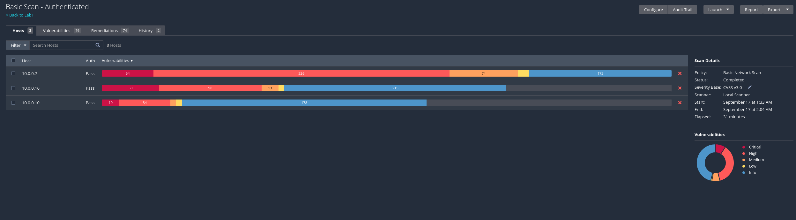 | 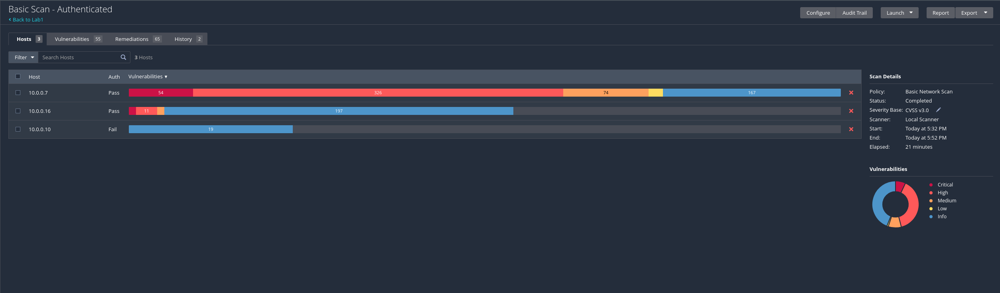 |

### 📷 Patch Installation

| Screenshot |
|---|
| 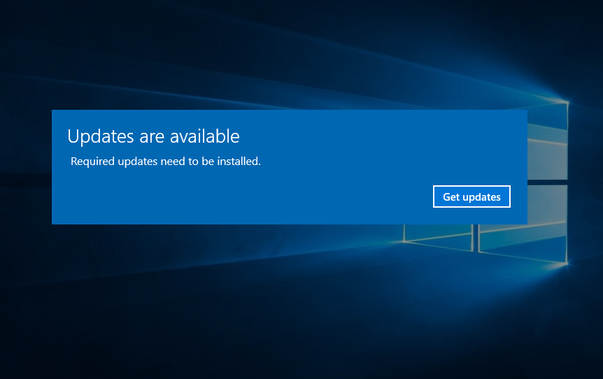 |
| 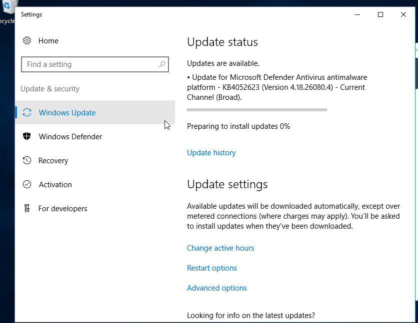 |
| 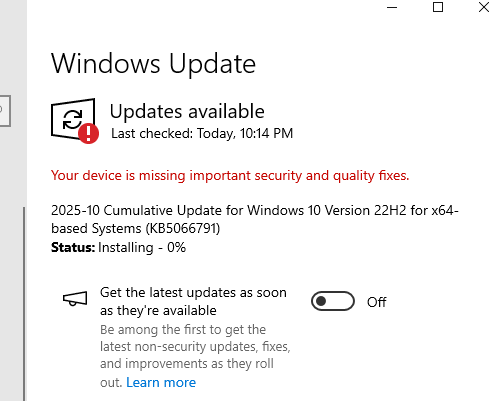 |

### 📷 Firewall & Network Segmentation Hardening

| Screenshot |
|---|
| 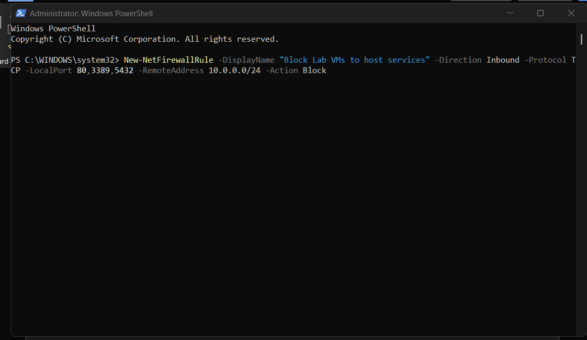 |
| 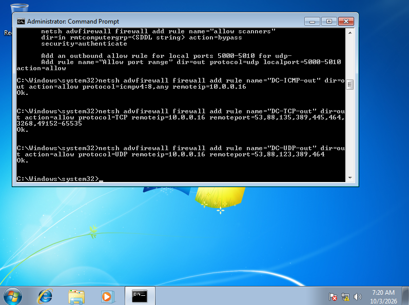 |
| 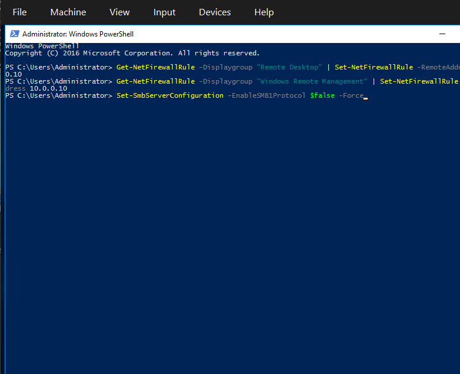 |
| 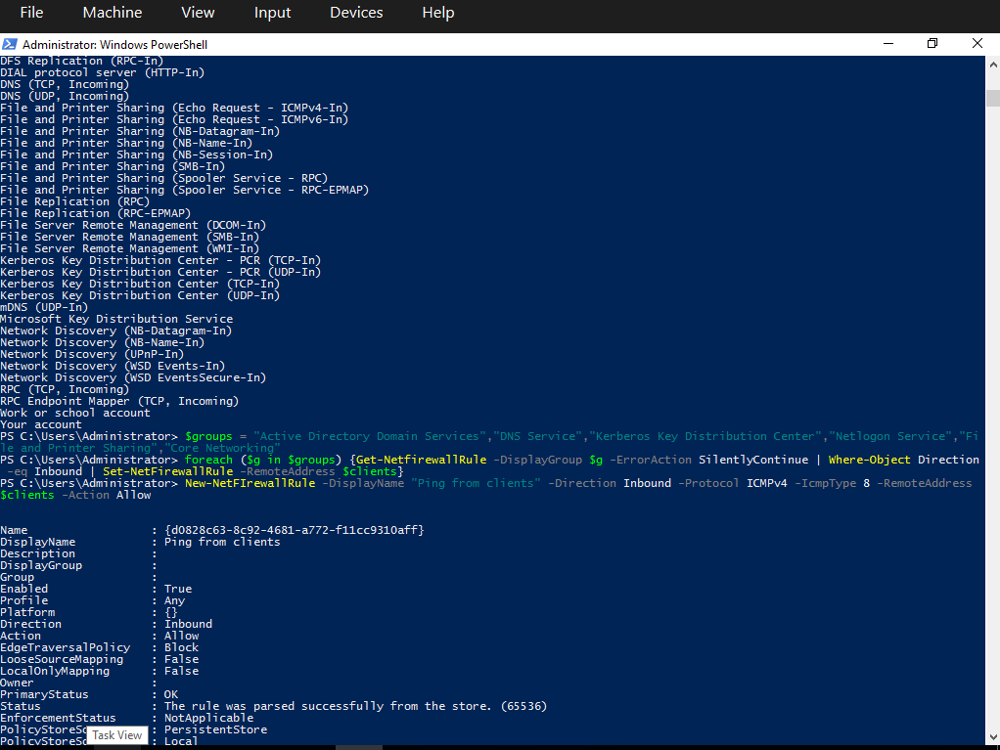 |
| 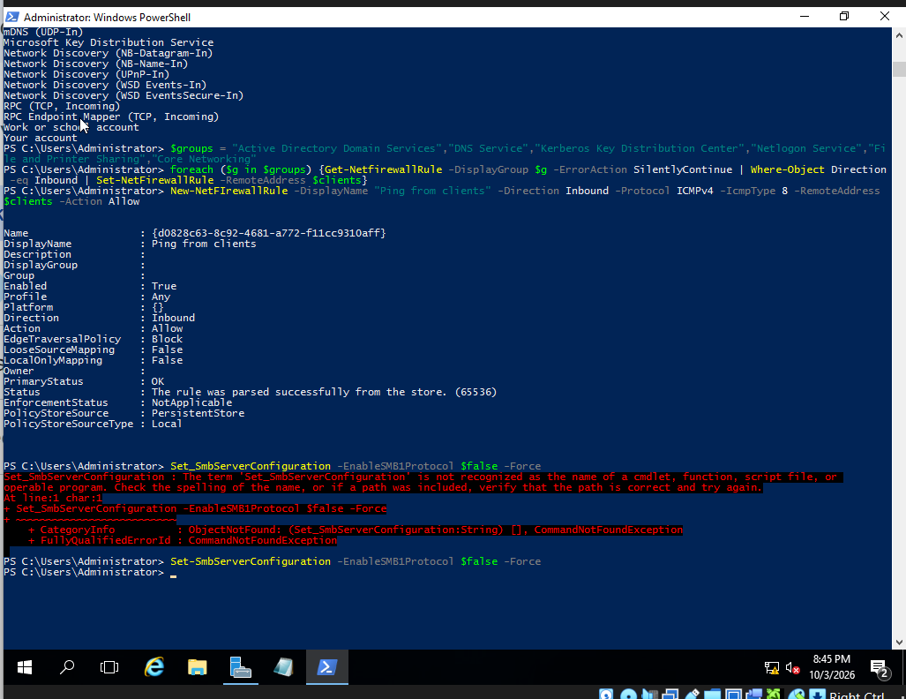 |
| 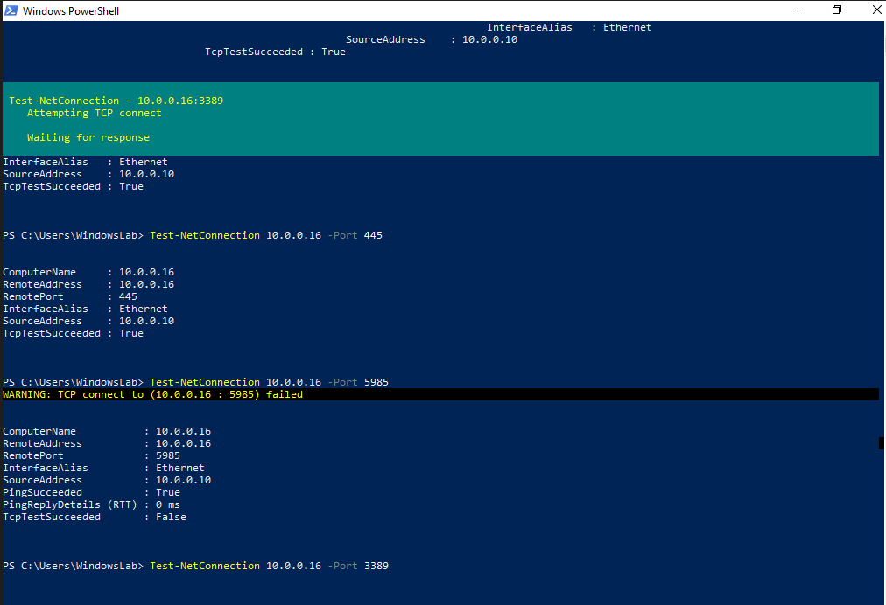 |

---

## `[ SECTION 10 ]` Author & Project Information

**👤 Author**
`Safwan Abdurahiman Kavil` — `CompTIA Security+`
LinkedIn: `www.linkedin.com/in/safwan-abdurahiman-kavil-sak03`

**📌 Project Information**
Program: `W4-FINAL` | Week / Phase: `[4 — Final]`

---
